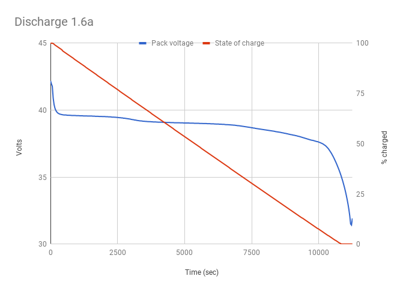

# DieBieMS command terminal
The DieBieMS is an open source/open hardware Battery Management System (BMS) originally developed for electric skateboards. A BMS helps ensure multi-cell battery packs are charged correctly; extending the life of a battery pack, and improving safety. The DieBieMS can be configured to support a range of battery pack configurations and cell chemistries. For more details see the [DieBieMS repositories](https://github.com/DieBieEngineering/DieBieMS/).

*The command line tool in this repository supports sending terminal commands to the DieBieMS via a USB based serial interface.*

The DieBieMS implements a subset of the serial interface used by the [VESC](https://github.com/vedderb/bldc) speed controller, allowing a number of existing applications and libraries a simple means of communication. This tool makes use of the [PyVESC library](https://github.com/LiamBindle/PyVESC) for communication with the DieBieMS.

## Setup

### Dependencies
The following process assumes the following dependencies have been installed.
- [Python 3.4+](https://www.python.org/)
- [virtualenv](https://virtualenv.pypa.io)

Note: virtualenv is a nice to have, not really a dependency but the following install process makes use of this tool...

### Install

Clone the project

    git clone https://github.com/lachlanhurst/diebiems-cmd-terminal.git
    cd diebiems-cmd-terminal

Create a fresh python virtual environment making sure python 3 is used.

    virtualenv venv

Activate the virtual environment (to deactivate later type `deactivate` at the cmd prompt). Note: this process differs for Linux/MacOS and Windows.

Windows:

    venv\Scripts\activate

Linux / MacOS:

    source venv/bin/activate

Confirm python 3 is being used in the venv (output should report python v3.4+)

    python --version

Install dependencies as listed in `requirements.txt` needed for this app to run. As we've activated the virtualenv these will be installed into the venv folder (and not into your system python).

    pip install -r requirements.txt

That's it!

## Usage

To print the command line help detailing available arguments for this application use the `-h` arg.

    python dbmscmdterminal.py -h

To list the available serial ports run the following command.

    python dbmscmdterminal.py -l

This will produce output similar to that below. Note: this will differ across platforms.

MacOS eg;

    /dev/cu.Bluetooth-Incoming-Port
    /dev/cu.locks-WirelessiAP
    /dev/cu.SLAB_USBtoUART

Windows eg;

    COM3

From the above list you will need to identify the serial port to which the DieBieMS is connected. In this case it's the `/dev/cu.SLAB_USBtoUART`, this serial port name needs to be included in all command executions. Refer to the troubleshooting section below if none of the listed serial ports seem like they belong to the BMS.

To send a terminal serial command on the DieBieMS run the following. The `-sp` arguement is the serial port identified in the previous step, and the argument following the `-c` arg is the terminal command to run.

    python dbmscmdterminal.py -sp /dev/cu.SLAB_USBtoUART -c hwinfo

Output:

    -------    BMS Info   -------
    Firmware: V0.11
    Hardware: V0.5
    Name    : DieBieMS
    UUID: XX XX XX XX XX XX XX XX XX XX XX XX

To see the full list of available DieBieMS terminal commands run the following (this is a DieBieMS generated help message).

    python dbmscmdterminal.py -sp /dev/cu.SLAB_USBtoUART -c help

**Note:** terminal commands including spaces will need to be surrounded by quotation marks (eg; `-c "config_set_cells 12"`)

### Record mode
Record mode differs a little to the other commands in that it does not return the command prompt until cancelled by the user (press ctrl-c to exit). During record mode the `cells` and `status` DieBieMS terminal commands are run periodically, the responses reformatted and written to a CSV file.

To start record mode use the `-r` arg.

    python dbmscmdterminal.py -sp /dev/cu.SLAB_USBtoUART -r

Some of the available outputs were used in the following chart.

## Troubleshooting

Check to make sure the USB cable is connected to both the PC and BMS ;-)

If you have another application connected to the serial port (eg; VESC Tool) this application will not be able to make a connection. Either disconnect or close the other application.

If you're unable to find the USB serial interface, or it fails to connect it may be due to missing USB drivers. I've had success with the ones from [here](https://www.silabs.com/products/development-tools/software/usb-to-uart-bridge-vcp-drivers).
